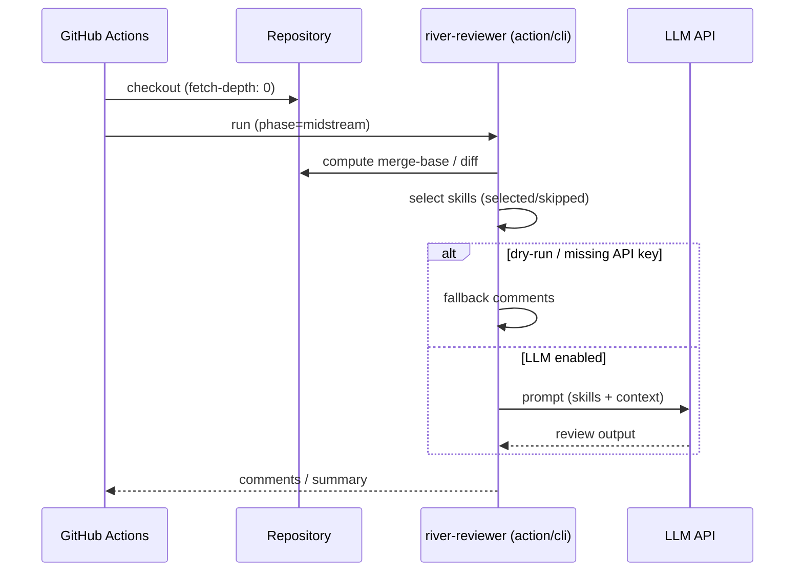
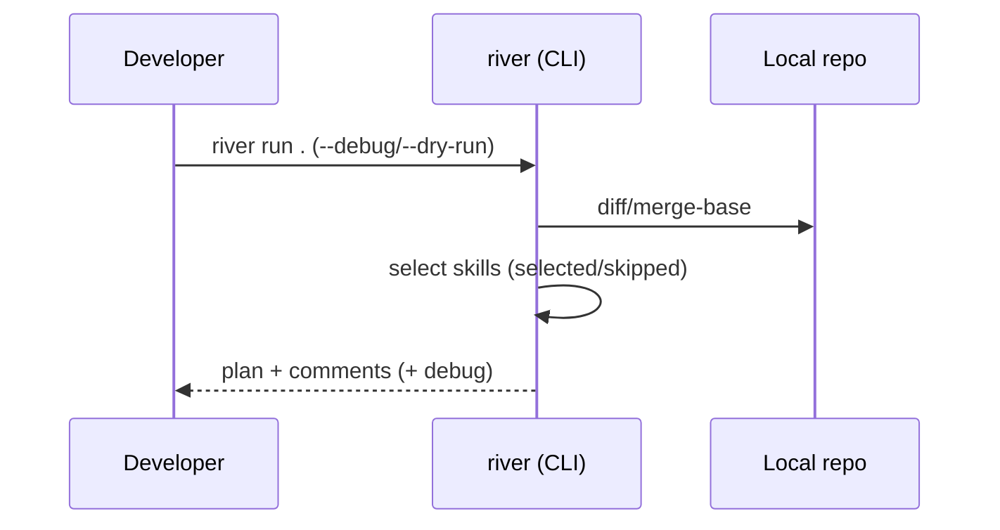

# River Reviewer のアーキテクチャ

River Reviewer は、変更の流れに沿って「上流 → 中流 → 下流」の観点でレビューを組み立てます。

- **上流（upstream）**: 要件、設計、ADR、脅威モデル、制約
- **中流（midstream）**: 実装、リファクタ、CI 組み込み、品質
- **下流（downstream）**: テスト、リリース、運用、失敗パス検知

加えて、**Riverbed Memory** は意思決定や前提（ルール）を保持し、レビューの一貫性を高めるための層です。

## コンポーネント

```mermaid
flowchart LR
  Diff[Git diff / PR diff] --> Optimizer[Diff optimizer]
  Optimizer --> Loader[Skill loader]
  Loader --> Filter{phase/applyTo\ninputContext/dependencies}
  Filter -->|selected| Planner[Skill planner\n(optional)]
  Filter -->|skipped + reasons| Skipped[Skipped list]
  Planner --> Runner[Review runner]
  Runner --> Output[Output schema\nissues[] + summary]
```

## 代表フロー（GitHub Actions）



## 代表フロー（ローカル）


